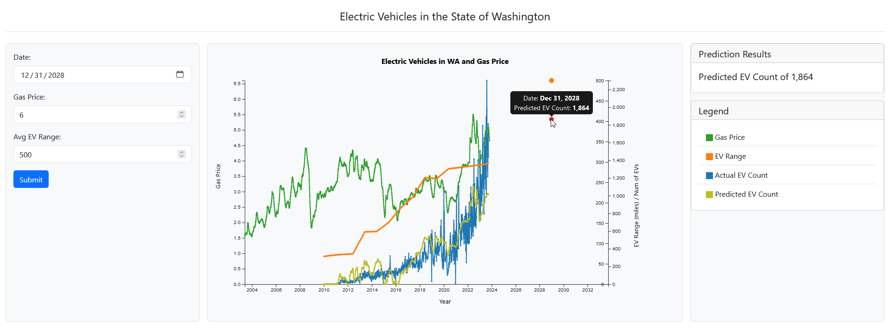

<br/>
<p align="center">
  <a href="https://github.gatech.edu/sminallah3/cse6242-team124">
  </a>

  <h3 align="center">Team 124 Project</h3>

  <p align="center">
    Electric Vehicle Demand Forecasting and Associated Incentives <br><br> Team Members: Aashna Punwani, Ashley Taken, Joshua Francis, Nikita Hedge, Syed Minallah
    <br/>
    <br/>
    <a href="https://github.gatech.edu/sminallah3/cse6242-team124"><strong>Explore the docs »</strong></a>
    <br/>
    <br/>
    <a href="https://github.gatech.edu/sminallah3/cse6242-team124/issues">Report Bug</a>
    .
  </p>
</p>

## Table Of Contents

* [About the Project](#about-the-project)
* [Built With](#built-with)
* [Getting Started](#getting-started)
  * [Prerequisites](#prerequisites)
  * [Installation](#installation)
* [Usage](#usage)
* [Contributing](#contributing)
* [License](#license)
* [Authors](#authors)
* [Acknowledgements](#acknowledgements)

## About The Project



There are many fantastic studies conducted on electric vehicles (EVs) which aim to forecast future EV demand using various inputs. This project achieves this and more. 

In addition to forecasting EV demand at any user input date up to 10 years into the future in the state of Washington, this project also allows user input for the two inputs to the predictive model- gas price and average EV range. This unique feature allows interested parties to determine future EV demand depending on their own projections on future gas price and EV range on a certain date.

A list of commonly used resources that I find helpful are listed in the acknowledgements. You may also suggest changes by forking this repo and creating a pull request or opening an issue.

## Built With

While Team 124 made up the main development of this project, we couldn't have done it without the help of these open source projects. Special thanks to:

- [JavaScript](https://www.javascript.com/)
- [Bootstrap](https://getbootstrap.com/)
- [SQLite](https://www.sqlite.org/index.html)
- [DB Browser for SQLite](https://sqlitebrowser.org/)
- [SQL.js](https://sql.js.org/#/)
- [Machine Learning Tools in Javascript](https://github.com/mljs/ml)

## Getting Started

To get a local copy up and running follow these simple example steps.

### Prerequisites

You will need Javascript, DB Browser for SQLite, and d3.js v7 in order to make your own changes to this repo.

### Installation

Windows:
1. Clone the repo. *Note - this will require authentication with GATech username and password entry if you are not already logged into github.gatech.edu

```sh
git clone https://github.gatech.edu/sminallah3/cse6242-team124.git
```
2. Navigate to the repo folder locally with:

```sh
cd "cse6242-team124"
```
3. Launch a local web server by running: 

```sh
start-web-server.bat
```
4. Type the following browser link to access the interactive graph: 

```sh
http://localhost:8888/
```
5. The interactive graph can be accessed by clicking on the folder link within the browser: 

```sh
evwebapp/
```

Mac:
1. Clone the repo. *Note - this will require authentication with GATech username and password entry if you are not already logged into github.gatech.edu

```sh
git clone https://github.gatech.edu/sminallah3/cse6242-team124.git
```
2. Navigate to the repo folder locally with:

```sh
cd "cse6242-team124"
```
3. Launch a local web server by navigating to the file location of the cloned repository on your local machine and running the following command:

```sh
python3 -m http.server 8888
```
4. Type the following browser link to access the interactive graph: 

```sh
http://localhost:8888/
```
5. The interactive graph can be accessed by clicking on the folder link within the browser: 

```sh
evwebapp/
```

## Usage

While in the web browser on localhost:8888, launch the "evwebapp" folder which will launch the application. Once the interactive tool is launched, you can interact with the tool in the following ways:

1) Input your desired Date, Gas Price, and Avg EV Range on the left panel which will be used to update the model's future EV range prediction anywhere from 2023 - 2033.
2) Hover over the chart on the regression lines and predicted values to reveal the exact date and value for that specific spot.

## Updating SQLite Databases

1. Download SQLiteFlow application from https://www.sqliteflow.com
2. Open SQLiteFlow application
3. Click open a database
4. Navigate to the path where the repo was cloned in the Installation instructions above and navigate to the evwebapp/data/evdata.db
5. Click Open. This should populate the 3 tables and 10 views
6. Now the data files used in the project are all located in /.../cse6242-team124/archive
7. Make any changes to the dataset in these files. For example, WA_Gas_Price.csv
8. Navigate back to SQLiteFlow and click Import
9. Select CSV file and provide the path of the /.../cse6242-team124/archive/WA_Gas_Price.csv file
10. Select First Line is header
11. Select Import to Database as evdata
12. Select the table as wa_gas_price
13. Select the truncate option if it is necessary to remove all the old records
14. Click Import
15. The dataset should now be updated in the database and in the visualization located in localhost:8888

## Contributing

Contributions are what make the open source community such an amazing place to be learn, inspire, and create. Any contributions you make are **greatly appreciated**. Check out the "analysis" folder to see a Jupyter notebook version of the code.
* If you have suggestions for adding or removing projects, feel free to [open an issue](https://github.com/ShaanCoding/cse6242-team124/issues/new) to discuss it, or directly create a pull request after you edit the *README.md* file with necessary changes.
* Please make sure you check your spelling and grammar.
* Create individual PR for each suggestion.
* Please also read through the [Code Of Conduct](https://github.com/ShaanCoding/cse6242-team124/blob/main/CODE_OF_CONDUCT.md) before posting your first idea as well.

### Creating A Pull Request

1. Fork the Project
2. Create your Feature Branch (`git checkout -b feature/AmazingFeature`)
3. Commit your Changes (`git commit -m 'Add some AmazingFeature'`)
4. Push to the Branch (`git push origin feature/AmazingFeature`)
5. Open a Pull Request

## License

Distributed under the MIT License. See [LICENSE](https://github.com/ShaanCoding/cse6242-team124/blob/main/LICENSE.md) for more information.

## Authors

* **Aashna Punwani** - *Georgia Tech OMSA Student*
* **Ashley Taken** - *Georgia Tech OMSA Student*
* **Joshua Francis** - *Georgia Tech OMSCS Student*
* **Nikita Hegde** - *Georgia Tech OMSA Student*
* **Syed Minallah** - *Georgia Tech OMSCS Student*

## Acknowledgements

* [ShaanCoding](https://github.com/ShaanCoding/)
* [Othneil Drew](https://github.com/othneildrew/Best-README-Template)
* [ImgShields](https://shields.io/)
* [codeopen.io](https://codepen.io/bagaski/full/RwKvybw)
